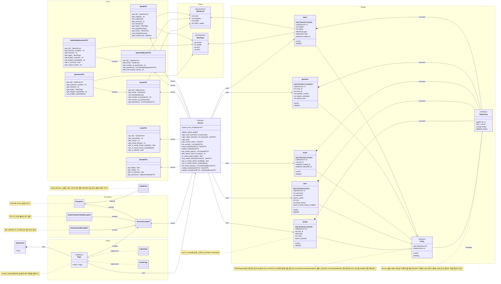

# Class Diagram

```mermaid
classDiagram
direction LR

note for Page "visit()은 다음에 방문해야 할\n페이지의 객체를 반환한다."
note for Exception "Python의 built-in 클래스이다."
note for UnauthorizedException "주로 사용자가 로그인 되어있지 않은 경우 발생"
note for AuthenticationFailedException "주로 로그인에 실패할 경우 발생"
note for Repository "Service 클래스에서 사용할 각 엔티티별 레포지토리의 구현체는\n본 다이어그램에 나타나있지 않지만 구현할 필요가 있다."
note for ValueError "Python의 built-in 클래스이다.\n주로 값이 잘못 세팅되어 있을 경우 발생\n(특히 DTO)"
note for Streak "(user_id, date)에 대해 고유하다.\n(Unique Constraint)"
note for Entity "아직 Repository에 저장되지 않은\nEntity의 id는 None이다.\n\n저장이 될때 id를 할당 받는다.\n(Autoincrement)\n\ndao는 클래스 변수이다.\n\nsave()/delete()는 해당 엔티티\n인스턴스를 dao에서 저장/제거한다."

Application *-- Page : uses

Page <|.. LoginPage : implements
Page <|.. HomePage : implements
Page --> Service : uses
Page --> ServiceException : handles

UnauthorizedException --|> ServiceException : extends
AuthenticationFailedException --|> ServiceException : extends
Exception <|-- ServiceException : extends
Exception <|-- ValueError : extends
ServiceException <-- Service : raises

StreakDTO <-- Service : serves
UserDTO <-- Service : serves
ExamDTO <-- Service : serves
SubmittedExamDTO <-- Service : serves
WordDTO <-- Service : serves

ExamDTO --> WordLevel
QuestionDTO --o ExamDTO : contains
QuestionDTO --> WordType

SubmittedExamDTO --> WordLevel
SubmittedQuestionDTO --o SubmittedExamDTO : contains
SubmittedQuestionDTO --> WordType

WordDTO --> WordType
WordDTO --> WordLevel

Service --> Streak : uses
Service --> User : uses
Service --> Exam : uses
Service --> Question : uses
Service --> Word : uses

Streak --|> Entity
User --|> Entity
Exam --|> Entity
Question --|> Entity
Word --|> Entity

Entity --o Repository : manages

Streak *-- Repository : accesses
User *-- Repository : accesses
Exam *-- Repository : accesses
Question *-- Repository : accesses
Word *-- Repository : accesses

WordType <-- Word
WordLevel <-- Word

namespace Pages {
    class Page
    class LoginPage
    class HomePage
}

namespace Exceptions {
    class Exception
    class ServiceException
    class UnauthorizedException
    class AuthenticationFailedException
}

namespace DTOs {
    class UserDTO
    class StreakDTO
    class WordDTO
    class ExamDTO
    class QuestionDTO
    class SubmittedExamDTO
    class SubmittedQuestionDTO
}

namespace Enums {
    class WordType
    class WordLevel
}

namespace Models {
    class Repository
    class Entity

    class User
    class Streak
    class Word
    class Exam
    class Question
}

class Application {
    +run()
}

class Page {
    <<Interface>>
    +visit() Page
}

class Service {
    <<Service>>
    -current_user_id Optional~int~
    -update_streak_graph()

    +sign_in(str username, str password)
    +sign_up(str username, str password) UserDTO
    +sign_out()
    +get_current_user() UserDTO

    +list_words() List~WordDTO~
    +save_word(WordDTO) WordDTO
    +delete_word(WordDTO)

    +get_streak_graph() List~StreakDTO~
    +get_streak_count_of_today() int
    +is_streak_filled_today() bool
    +buy_streak_freeze(int amount) UserDTO
    +get_is_streak_freeze_enabled() bool
    +set_is_streak_freeze_enabled(bool)

    +list_exam_history() List~SubmittedExamDTO~
    +create_exam(ExamDTO) ExamDTO
    +submit_exam(ExamDTO) SubmittedExamDTO
}

class UserDTO {
    +get_id() Optional~int~
    +get_username() str
    +get_coins() int
    +get_streak_freeze() int
    +get_is_streak_freeze_enabled() bool
    +set_is_streak_freeze_enabled(bool)
    +get_is_admin() bool
}

class WordDTO {
    +get_id() Optional~int~
    +get_english() str
    +set_english(str)
    +get_korean() str
    +set_korean(str)
    +get_type() WordType
    +set_type(WordType)
    +get_level() WordLevel
    +set_level(WordLevel)
    +get_created_at() datetime
}

class ExamDTO {
    +get_id() Optional~int~
    +get_level() WordLevel
    +set_level(WordLevel)
    +get_number_of_questions() int
    +set_number_of_questions(int)
    +get_questions() List~QuestionDTO~
}


class QuestionDTO {
    +get_id() Optional~int~
    +get_question_number() int
    +get_korean() str
    +get_type() WordType
    +get_english_submitted() str
    +set_english_submitted(str)
}

class SubmittedExamDTO {
    +get_id() Optional~int~
    +get_level() WordLevel
    +get_number_of_questions() int
    +get_questions() List~SubmittedQuestionDTO~
    +get_total_reward_coins() int
}

class SubmittedQuestionDTO {
    +get_id() Optional~int~
    +get_question_number() int
    +get_korean() str
    +get_type() WordType
    +get_english_answer() str
    +get_english_submitted() str
    +get_is_correct() bool
    +get_reward_coins() int
}

class StreakDTO {
    +get_date() date
    +get_value() int
    +get_is_freezed() bool
    +get_previous() Optional~StreakDTO~
}

class Repository~E~ {
    <<Interface>>
    +get(int id) E
    +all() List~E~
    +save(E entity)
    +delete(E entity)
}

class Entity~E~ {
    <<Abstract>>
    +dao Repository~E~*
    +Optional~int~ id
    +save()
    +delete()
}

class User {
    +dao Repository~User~$
    +Optional~int~ id
    +str username
    +str password
    +bool is_admin
    +int coin
    +int streak_freeze
    +bool is_streak_freeze_enabled
    +save()
    +delete()
}

class Streak {
    +dao Repository~Streak~$
    +Optional~int~ id
    +int user_id
    +date date
    +int value
    +bool is_freezed
    +save()
    +delete()
}

class Word {
    +dao Repository~Word~$
    +Optional~int~ id
    +str english
    +str korean
    +WordType type
    +WordLevel level
    +datetime created_at
    +save()
    +delete()
}

class Exam {
    +dao Repository~Exam~$
    +Optional~int~ id
    +int user_id
    +datetime created_at
    +datetime submitted_at
    +save()
    +delete()
}

class Question {
    +dao Repository~Question~$
    +Optional~int~ id
    +int exam_id
    +int word_id
    +int question_number
    +str english_submitted
    +int reward_coins
    +save()
    +delete()
}

class WordType {
    <<Enumeration>>
    +str NOUN
    +str VERB
    +str ADJ
    +str ADV
}

class WordLevel {
    <<Enumeration>>
    +int EASY
    +int NORMAL
    +int HARD
    +int VERY_HARD
}
```
